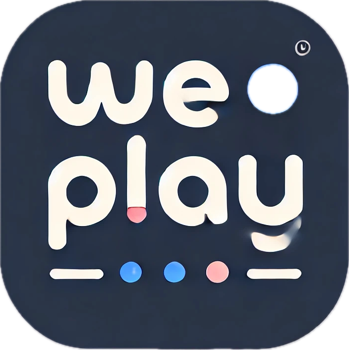
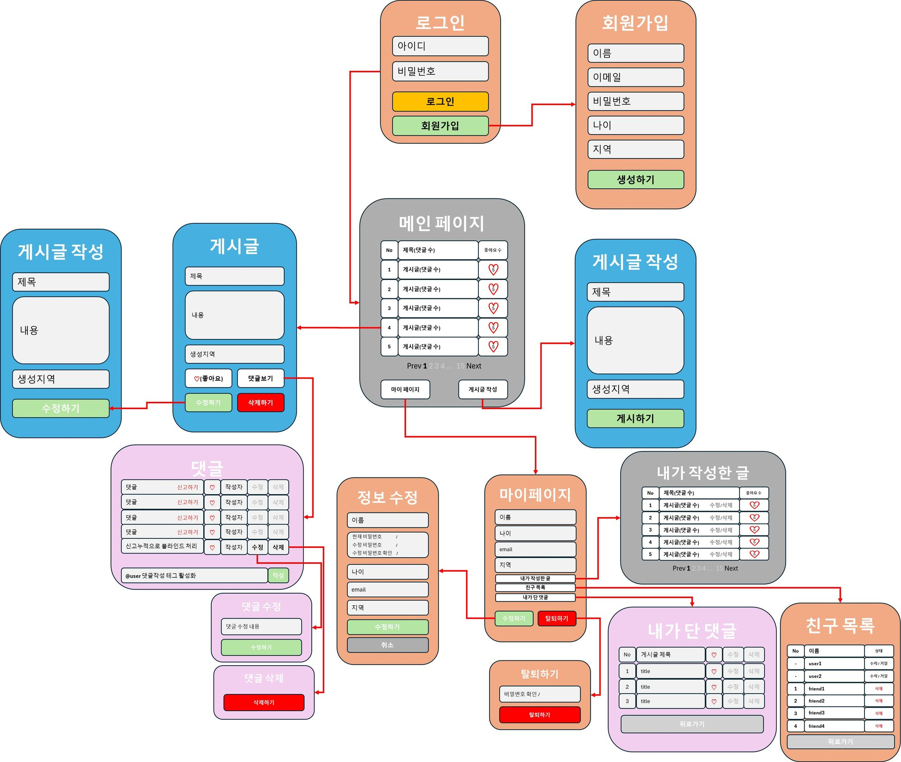
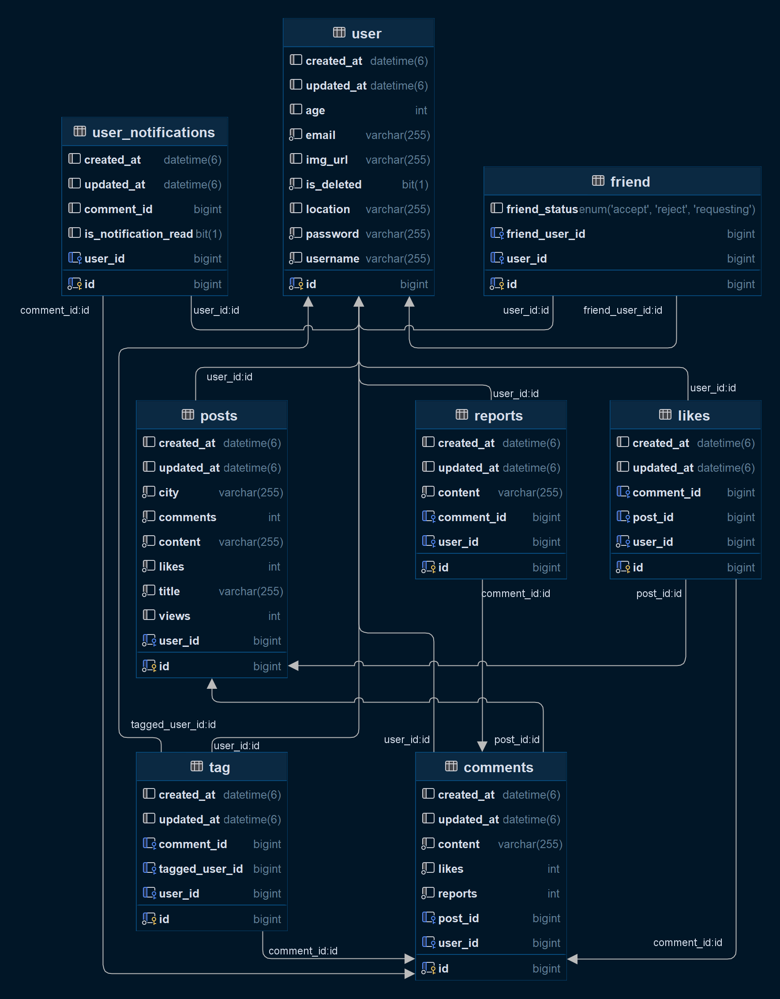

<h1> 
 We - Play  빠르게 만나는 소모임 동아리</h1>

<h2>구현한 기능</h2>

### User (유저 기능)
- **회원가입**: 새로운 유저 계정을 생성.
- **로그인**: 유저 계정으로 로그인.
- **유저 정보 조회**: 자신의 유저 정보 조회.
- **유저 정보 수정**: 본인만 자신의 유저 정보 수정 가능.
- **회원 탈퇴**: 본인 계정 탈퇴.

### Post (게시글 기능)
- **게시글 작성**: 새로운 게시글 작성.
- **모든 게시글 조회**: 등록된 모든 게시글 조회.
- **게시글 단건 조회**: 특정 게시글을 조회하며, 조회 시마다 조회수 증가.
- **게시글 수정**: 본인만 자신의 게시글 수정 가능.
- **게시글 삭제**: 본인만 자신의 게시글 삭제 가능.
- **뉴스피드 조회**: 본인 및 친구의 게시글을 포함한 뉴스피드 조회.

### Comment (댓글 기능)
- **댓글 작성**: 게시글에 댓글 작성.
- **댓글 조회**: 특정 게시글 ID 또는 유저 ID로 댓글 조회 가능.
- **댓글 수정**: 본인만 자신의 댓글 수정 가능.
- **댓글 삭제**: 본인만 자신의 댓글 삭제 가능.
- **댓글 신고 기능**: 댓글 신고가 3번 누적되면 해당 댓글이 블라인드 처리됨.

### Like (좋아요 기능)
- **게시글 좋아요 생성**: 본인이 작성한 게시글에는 좋아요 불가, 이미 좋아요한 게시글에 중복 좋아요 방지.
- **게시글 좋아요 삭제**: 좋아요한 사람만 좋아요 취소 가능.
- **댓글 좋아요 생성**: 본인이 작성한 댓글에는 좋아요 불가, 이미 좋아요한 댓글에 중복 좋아요 방지.
- **댓글 좋아요 삭제**: 좋아요한 사람만 좋아요 취소 가능.

### Friend (친구 기능)
- **친구 요청**: 다른 유저에게 친구 요청 가능.
- **친구 요청 리스트 조회**: 본인이 보낸 친구 요청, 본인이 받은 친구 요청 리스트 조회.
- **친구 요청 상태 변경**: 친구 요청 상태 변경 가능 (수락, 거절 등).
- **친구 삭제**: 특정 유저를 친구 리스트에서 삭제.

<h2>팀원 소개</h2>

### 문정석(리더)
#### - 필수 구현
- 친구 요청
- 친구 요청 리스트 조회
- 친구 요청 상태 변경
- 친구 삭제
#### - 공통 구현
- JWT 인증 / 인가 구현
- 예외 처리 추가

### 안예환
- 게시글 작성
- 모든 게시글 조회
- 특정 게시글 조회
- 게시글 수정
- 게시글 삭제
- 사용자 뉴스피드 조회

### 전현욱
#### - 필수 구현
- 회원가입
- 로그인
- 유저 정보 조회
- 유저 정보 수정
- 회원탈퇴
#### - 공통 구현
- Common Entity(ID, 시간) 구현
#### - 추가 구현
- 유저 알림 조회
- 댓글 테그 기능

### 임채규
#### - 필수 구현
- 게시글 좋아요 생성
- 댓글 좋아요 생성
- 게시글 좋아요 제거
- 댓글 좋아요 제거
#### - 추가 구현
- 게시글 조회수 기능 추가

### 강동준
#### - 필수 구현
- 댓글 작성
- 게시글 댓글 조회
- 유저 댓글 조회
- 댓글 수정
- 댓글 삭제
#### - 추가 구현
- 댓글 신고

<h2>와이어프레임</h2>

<h2>ERD</h2>

 

# API 명세서

## 1. 유저 API

| 기능       | URL                       | Method | Request Header           | Request Body                                                                                                                           | Response Header          | Response                                                                                                                      |
|----------|---------------------------|--------|--------------------------|----------------------------------------------------------------------------------------------------------------------------------------|--------------------------|-------------------------------------------------------------------------------------------------------------------------------|
| 회원가입     | `/api/signup`             | POST   | N/A                      | { "email": "user@example.com", "password": "password123", "username": "exampleuser", "age": 25, "location": "Seoul", "imgurl": "url" } | Authorization: jwt-token | "succecs"                                                                                                                     |
| 로그인      | `/api/login`              | POST   | N/A                      | { "email": "user@example.com", "password": "password123" }                                                                             | Authorization: jwt-token | "success"                                                                                                                     |
| 유저 정보 조회 | `/api/users`              | GET    | Authorization: jwt-token | N/A                                                                                                                                    | N/A                      | { "id": 1, "email": "user@example.com", "username": "exampleuser", "age": 25, "location": "Seoul","imgurl": "url" }           |
| 유저 정보 수정 | `/api/users`              | PUT    | Authorization: jwt-token | { "email": "user@example.com", "password": "password123", "username": "exampleuser", "age": 25, "location": "Seoul", "imgurl": "url" } | N/A                      | "success"                                                                                                                     |
| 회원탈퇴     | `/api/users`              | POST   | Authorization: jwt-token | {"email": "user@example.com", "password": "password123"}                                                                               | N/A                      | "success"                                                                                                                     |
| 유저 알림 조회 | `/api/users/notification` | GET    | Authorization: jwt-token | N/A                                                                                                                                    | N/A                      | { "id":1, "content": "abc123", "content": "1234", username": "exampleuser", "likeCount": 0, "createdAt": "", "updatedAt": ""} |

## 2. 친구 API

| 기능           | URL                                | Method | Request Header           | Request Body            | Response Header | Response                                      |
|--------------|------------------------------------|--------|--------------------------|-------------------------|-----------------|-----------------------------------------------|
| 친구 요청        | `/api/friends/reques/{friendId}`   | POST   | Authorization: jwt-token | { "friend_user_id": 2 } | N/A             | { "success" }                                 |
| 친구 요청 리스트 조회 | `/api/friends/requests`            | POST   | Authorization: jwt-token | N/A                     | N/A             | { "userName": "user1", ""userName": "user2" } |
| 친구 요청 상태 변경  | `/api/friends/{status}/{friendId}` | POST   | Authorization: jwt-token | N/A                     | N/A             | { "success" }                                 |
| 친구 삭제        | `/api/friends/{friendId}`          | POST   | Authorization: jwt-token | N/A                     | N/A             | { "success." }                                |

## 3. 게시글 API

| 기능                      | URL                   | Method | Request Header           | Request Body                                                             | Response Header | Response                                                                                               |
|-------------------------|-----------------------|--------|--------------------------|--------------------------------------------------------------------------|-----------------|--------------------------------------------------------------------------------------------------------|
| 게시글 작성                  | `/api/posts`          | POST   | Authorization: jwt-token | { "title": "Post Title", "content": "This is a post.", "city": "Seoul" } | N/A             | { "id": 1, "title": "Post Title", "content": "This is a post.", "city": "Seoul", "created_at": "..." } |
| 모든 게시글 조회               | `/api/posts`          | GET    | Authorization: jwt-token | N/A                                                                      | N/A             | { "id": 1, "title": "Post Title", "content": "This is a post.", "city": "Seoul", "views": 100 }        |
| 특정 게시글 조회               | `/api/posts/{postId}` | GET    | Authorization: jwt-token | N/A                                                                      | N/A             | { "id": 1, "title": "Post Title", "content": "This is a post.", "city": "Seoul", "views": 100 }        |
| 특정 게시글 수정               | `/api/posts/{postId}` | PUT    | Authorization: jwt-token | { "title": "Updated Title", "content": "Updated content." }              | N/A             | { "id": 1, "title": "Updated Title", "content": "Updated content.", "updated_at": "..." }              |
| 게시글 삭제                  | `/api/posts/{postId}` | DELETE | Authorization: jwt-token | N/A                                                                      | N/A             | "게시글이 삭제 되었습니다."                                                                                       |
| 사용자 뉴스피드 조회(친구의 게시글 포함) | `/api/posts/newsfeed` | GET    | Authorization: jwt-token | N/A                                                                      | N/A             | { "id": 1, "title": "Post Title", "content": "This is a post.", "city": "Seoul", "views": 100 }        |

## 4. 댓글 API

| 기능         | URL                                 | Method | Request Header           | Request Body                        | Response Header | Response                                                                                                  |
|------------|-------------------------------------|--------|--------------------------|-------------------------------------|-----------------|-----------------------------------------------------------------------------------------------------------|
| 댓글 작성      | `/api/posts/{postId}/comments`      | POST   | Authorization: jwt-token | { "content": "This is a comment." } | N/A             | "댓글이 작성 되었습니다."                                                                                           |
| 댓글 조회(게시글) | `/api/posts/{postId}/comments`      | GET    | Authorization: jwt-token | N/A                                 | N/A             | { "id": 1, "postTitle": "게시글 제목", "content": "내용", "userName": "name", "likeCount": 0, "reportCount": 0 } |
| 댓글 조회(유저)  | `/api/comments/{userId}`            | GET    | Authorization: jwt-token | N/A                                 | N/A             | { "id": 1, "postTitle": "게시글 제목", "content": "내용", "userName": "name", "likeCount": 0, "reportCount": 0 } |
| 댓글 수정      | `/api/comments/{commentId}`         | PUT    | Authorization: jwt-token | { "content": "Updated comment." }   | N/A             | "댓글이 수정 되었습니다."                                                                                           |
| 댓글 삭제      | `/api/comments/{commentId}`         | DELETE | Authorization: jwt-token | N/A                                 | N/A             | "댓글이 삭제 되었습니다."                                                                                           |
| 댓글 신고      | `/api/comments/{commentId}/reports` | GET    | Authorization: jwt-token | N/A                                 | N/A             | "댓글이 신고가 완료 되었습니다."                                                                                       |

## 5. 좋아요 API

| 기능         | URL                               | Method | Request Header           | Request Body | Response Header | Response |
|------------|-----------------------------------|--------|--------------------------|--------------|-----------------|----------|
| 게시글 좋아요 생성 | `/api/posts/{postId}/likes`       | GET    | Authorization: jwt-token | N/A          | N/A             | N/A      |
| 댓글 좋아요 생성  | `/api/comments/{commentId}/likes` | GET    | Authorization: jwt-token | N/A          | N/A             | N/A      |
| 게시글 좋아요 제거 | `/api/posts/{postId}/likes`       | GET    | Authorization: jwt-token | N/A          | N/A             | N/A      |
| 댓글 좋아요 제거  | `/api/comments/{commentId}/likes` | GET    | Authorization: jwt-token | N/A          | N/A             | N/A      |

